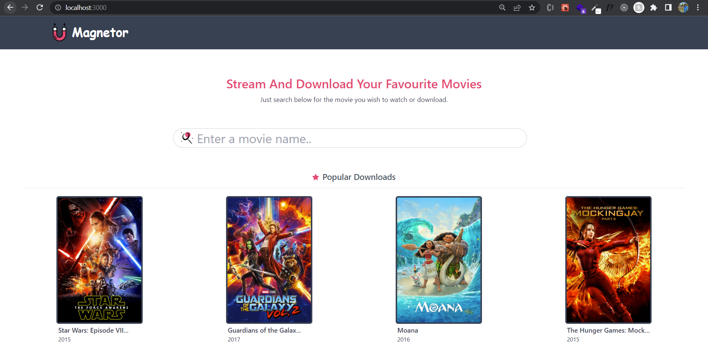

# Stream/download movies with Magnetor

This project was created with [React](https://react.dev/), [tailwindcss](https://tailwindcss.com/) [yts API][https://yts.mx/].

## Available Scripts

In the project directory, you can run:

### `npm install`

Installs the dependencies needed to run the application.

### `npm start`

Runs the app in the development mode.\
Open [http://localhost:3000](http://localhost:3000) to view it in the browser.

The page will reload if you make edits.\
You will also see any lint errors in the console.

